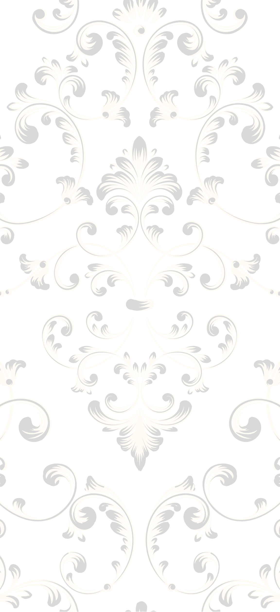

# Sitio Web para Quinceañera 👑

Este proyecto es un sitio web personalizado para la celebración de XV años de Jessica Paola, diseñado para ser móvil-friendly con una interfaz elegante y fácil de usar.



## 🌟 Características

- **Diseño Mobile-First**: Optimizado para dispositivos móviles con una navegación intuitiva
- **Barra de navegación fija**: Ubicada en la parte inferior para facilitar la navegación
- **Reproductor de música**: Con controles de reproducción y volumen
- **Cuenta regresiva**: Muestra el tiempo restante hasta el gran día
- **Galería de fotos**: Con efecto lightbox y opción para que los invitados suban fotos
- **Confirmación de asistencia**: Formulario para que los invitados confirmen su asistencia
- **Detalles del evento**: Secciones para la ceremonia religiosa y fiesta
- **Mesa de regalos**: Con sugerencias para los invitados
- **Animaciones de página**: Efectos suaves al navegar entre secciones
- **Fondo personalizable**: Posibilidad de cambiar la imagen de fondo

## 🛠️ Tecnologías Utilizadas

- [React](https://reactjs.org/) - Biblioteca para construir interfaces de usuario
- [React Router](https://reactrouter.com/) - Enrutamiento para aplicaciones React
- [Framer Motion](https://www.framer.com/motion/) - Animaciones fluidas
- [Tailwind CSS](https://tailwindcss.com/) - Framework CSS utilitario
- [DaisyUI](https://daisyui.com/) - Componentes para Tailwind CSS
- [Vite](https://vitejs.dev/) - Herramienta de construcción rápida para proyectos web

## 📱 Secciones Principales

1. **Inicio**: Página principal con cuenta regresiva y detalles generales
2. **Ceremonia**: Información sobre la ceremonia religiosa
3. **Fiesta**: Detalles sobre la recepción y celebración
4. **Asistencia**: Formulario para confirmar asistencia
5. **Galería**: Fotos del evento y opción para compartir fotos
6. **Padrinos**: Información sobre los padrinos
7. **Chambelanes**: Información sobre los chambelanes
8. **Regalos**: Mesa de regalos con sugerencias

## 🚀 Instalación y Uso

1. Clona este repositorio:
   ```bash
   git clone https://github.com/tu-usuario/quince-jessica.git
   cd quince-jessica
   ```

2. Instala las dependencias:
   ```bash
   npm install
   ```

3. Ejecuta el servidor de desarrollo:
   ```bash
   npm run dev
   ```

4. Para construir para producción:
   ```bash
   npm run build
   ```

## 📁 Estructura de Archivos

```
quince-jessica/
├── public/                 # Archivos estáticos
│   ├── audio/              # Archivos de música
│   └── images/             # Imágenes
│       ├── backgrounds/    # Fondos para el sitio
│       └── gallery/        # Imágenes para la galería
├── src/                    # Código fuente
│   ├── components/         # Componentes reutilizables
│   ├── pages/              # Páginas principales
│   ├── App.jsx             # Componente principal
│   ├── main.jsx            # Punto de entrada
│   └── index.css           # Estilos globales
├── .gitignore              # Archivos ignorados por Git
├── package.json            # Dependencias y scripts
├── vite.config.js          # Configuración de Vite
└── README.md               # Este archivo
```

## 🔧 Personalización

### Cambiar la imagen de fondo

1. Coloca tu imagen en la carpeta `public/images/backgrounds/`
2. Renómbrala como `bg-pattern.jpg` o modifica la ruta en `src/App.jsx`

### Cambiar la música de fondo

1. Coloca tu archivo de audio en la carpeta `public/audio/`
2. Renómbralo como `background-music.mp3` o modifica la ruta en `src/App.jsx`

### Personalizar información

Modifica los archivos en la carpeta `src/pages/` para actualizar la información específica del evento.

## 📝 Licencia

Este proyecto es de uso personal y está destinado para la celebración de XV años de Jessica Paola.

## 🙏 Agradecimientos

- A todos los desarrolladores de las bibliotecas y herramientas utilizadas
- A la familia y amigos que hacen posible esta celebración especial
